Paragon的头发所需要的贴图一共有五张，其分别是：
1. Diffuse：
    漫反射贴图，控制头发的颜色。
1. Alpha：
    用来控制头发的不透明区域，既透明。
1. Root：
    用来控制头发从发梢到发根的变化量。
1. Depth：
    深度，用来控制面片在头发上的嵌入程度，也可以用来当成其他控制量使用。
1. ID:
    ID贴图，用来描述发根的所属，通常用来产生随机切线和各向异性高光。


为了生成除Diffuse外的头发纹理，我们需要从一个头发的精确模型中，通过xNormal烘培。

* 通过xGen生成基本头发：
    1. 当你的账户是中文时，容易出现问题如xGen无法加载等，需要在`???\Autodesk\Mayaxxxx\plug-ins\xgen\scripts\xgenm`（请替换成你的安装路径）中，用记事本或其他字符串编辑器打开`xgGabal.py`，在`import xgenm as xgen`下面添加如下代码：
        ```python
        # Add Start

        import sys

        reload(sys)

        sys.setdefaultencoding('gb18030')

        # Add End
        ```
    1. 以Maya2018为例（Maya2016与Maya2018在xGen上的使用并无太大区别），在`窗口 -> 设置/首选项 -> 插件管理器`中找到插件管理器，加载`xGenToollit.mll`以及在同目录下的其他依赖库（可能需要重启Maya）。

        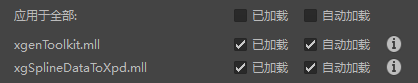

    1. 新建多边形基本体，放置一个平面，调整大小，以提供种植头发的的位置。
    1. 打开xGen操作界面，选中平面，在xGen操作界面中创建一个`xGen`新描述：

        
        
        

    1. 设置描述类型，基本体，和控制方式：
    
        
        
        
        
        
        
        其中，基本体若以随机横跨曲面的话，头发将随机种植，若在指定点，则需要自己种植。其属性可在编辑器中的基本体中编辑。

    1. 放置导向。导向用来控制头发的整体长度和方向，这个只是用来引导头发的生成，不需要太多。这个导向可被Maya自带的旋转和缩放工具进行调整。
    
        
    
        
    
    1. 选择要更改的导向，用雕刻导向工具，控制导向的走向
        
        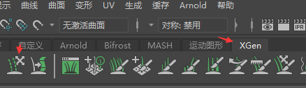
        
        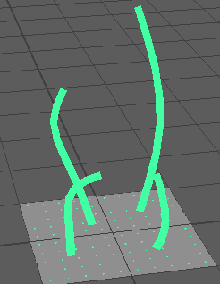
        
        注：当更改完导向后，并不会立刻刷新生成的毛发效果，需要点击下面所示的按钮刷新头发：
        
        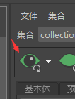
    
    1. 在`基本体/生成器属性`中，更改种子，密度和遮罩，在`基本体/基本体属性`中，更改长度与宽度，以查看生成效果：
        
        
    
        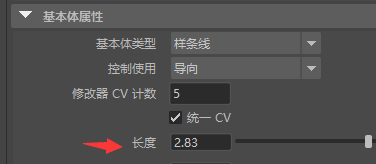
    
        
    
    1. 添加修改器，给与头发整体的效果
        
        
        
        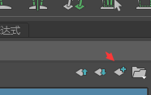
        
        

* 从xGen的头发中生成头发模型，其中共有两种方式：

    1. 头发->曲线->挤出成多面体。
    
        * 在 `预览/输出` 选项页中，找到 `输出设置`，在`运算`中设置为创建MEL文件，选择好文件夹后，点击创建文件：
    
            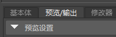
    
            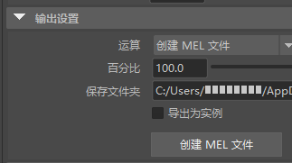
    
        * 重新导入MEL文件，即可看到生成出来的头发曲线。
    
        * 创建一个NURBS基本体的圆形，缩小到一定大小，然后通过`曲面->挤出`（`surface->extrude`）为头发曲线生成网格（注意输出集合体必须为多边形）：
        
            

    1. 头发->生成多面体

        * 选择头发，点击`生成 -> 将xGen基本体转换成多边形`（可能需要高版本Maya支持，本人用的是Maya2018）。
        
            

        * 关闭组合网格并生成。

            

        * 点选生成的面片，将UV分布到平面上（烘培Root贴图和Diffuse贴图时需要用到面片的UV），并做一些处理。
        
            

            

            若能拉直UV其实更好。

            注意，生成的面片有朝向问题！

* 模型导出。 生成完毕后，我们需要先对其分组。
    1. 首先先选择所有生成的网格，并运行下列Python代码：

         ```python
        import pymel.core as pm

        import random as rd

        # 分成的组数，这个可以根据需要修改，一般为3~5组。

        ListSperate = 5

        all_list = []

        for index in range(0, ListSperate):

            all_list.append([])

        sel = pm.selected()

        SelectedList = len(sel)

        EachListCount = int(SelectedList / ListSperate)

        if SelectedList % 5 != 0:

            EachListCount += 1

        for index in range(0, SelectedList):

            rendom_seed = rd.randint(0, EachListCount * ListSperate - 1 - index)

            for index2 in range(0, ListSperate):

                if rendom_seed < EachListCount - len(all_list[index2]):

                    all_list[index2].append(sel[index])

                    break

                else:

                    rendom_seed -= EachListCount - len(all_list[index2])

        for index in range(0, ListSperate):

            if len(all_list[index]) >= 2:

                pm.polyUnite(*(all_list[index]), n= "result")
                    
        ```
        为了保证分组不出现问题，请保证 **`网格体 >= 分组数 * 2`**。

    1. 将分组完毕后的网格体（若分成5组，就有5个网格体，当网格体 < 分组数*2 的时候，可能会有漏的）， **分别** 导出成.obj格式文件。（例如在上面的实例中，分成了5个组，就要导出5个文件.obj文件）

    1. 创建一个平面，使得其面对所有的头发网格。根据所需要产生的头发纹理的布局调整UV和大小：
        
        

        若模型是面片而非挤出的多边形，注意当视角面对平面的正方向时，必须保证能看到头发的面片。

    1. 调整平面UV，这会影响头发在生成出来的贴图中的位置。

    1. 选择平面，导出成Plane.obj。
    
    1. （可选）复制该平面，并平移，使得复制后的平面与原来的平面平行，并且保证头发网格被两个平面包含，并导出成PlaneCache.obj。
        
        

* 将模型和烘培纹理放入到xNormal中烘培：
    xNormal可在这个[地址](http://www.xnormal.net/)中下载。
    1. 在烘培前，我们需要通过PS生成几张纹理：
        
        
        
        * IDX.png 用于生成头发的ID值，其后跟随的值即为当前RGB的值，也是头发所属的ID值。这个与头发分组的组数有关，若如上例所示，导出了5组头发模型，既需要5个ID贴图，这个将用来生成头发纹理的ID图。
        * Gradient.png 是一张从0到255线性变换的贴图，用于标记头发的走向，用来生成头发纹理的Root图。
        * GrandientCrunched.png 是一张从0到255阶段性变化的贴图，用来控制头发的偏移，用来生成头发纹理的Depth图。

    1. 打开xNormal，装载低模。
        
        
        
        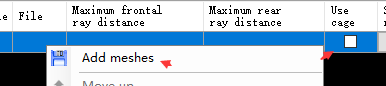
        
        将导出的plane.obj加入到列表中，并将`Use cage`点上，这个选项表示用两个Object来控制烘培的范围。
        接着将PlaneCache.obj添加到plane.obj的`External cage file`中。
        
        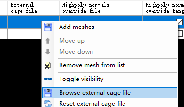
        
        Cache文件与原文件必须保持一致

        若不想使用Cache文件，则可以通过调整光追距离来控制。

        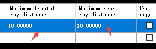

        这个数值可通过下面这个工具来获得：

        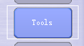

        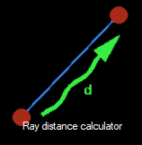

        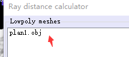

        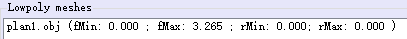

        填入上面的值。

    1. 装载高模。
        
        
        
        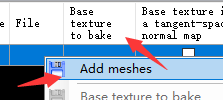
        
        将生成出来的几个头发模型都加入进去。`Base Texture to bake`是用作参考的烘培纹理，用来生成底色。
    1. 生成纹理。
        * 将所有Mesh的`Base Texture to bake`设置成纯白色的贴图。
        * 点击Baking option，准备烘培：
            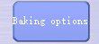
        * 将 `Discard back - face hits`的勾点掉，调整`Output File`设置输出纹理地址。`Size`设置输出纹理大小，`Edge padding`控制边界偏移，设置成0，`Maps to Render`选择`Bake base texture`，点击最又下角的`GenerateMap`开始烘培，得到AlphaMap。
        * 若纹理的方向和范围错误，可以通过修改plane.obj的UV和大小，并重新生成。同时也需要复制并重新生成planecache.obj。
        * 将IDX.png分别放入Mesh的`Base Texture to bake`中，既每一张不同的IDX.png对应不同的mesh，`Edge padding`设置成16，更改输出目录，开始烘培，得到IDMap。
        * 将`Base Texture to bake`换成Gradient.png，更改输出目录，开始烘培，得到Diffuse贴图。
        * 将`Base Texture to bake`换成GradientCrunched.png，更改输出目录，开始烘培，得到Root贴图。
        * `Maps to Render`中选择`Height Map`，更改输出目录，开始烘培，烘培完毕后，在弹出的窗口调整范围，关闭后得到Depth图。