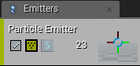
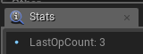
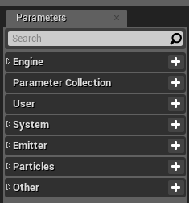

Niagara —— 下一代的粒子系统
---
注：至4.20.3为止，Niagara仍然是一个开发中的系统，还是有性能上和使用上的问题。

* Cascade的组织结构：（Cascade，瀑布？原先UE4的粒子系统
    * Module

        

        粒子的最基本功能组件，封装好的逻辑和数据。
    * Emitter

        

        一个粒子发射器，由众多Module组成，组成一组相似的粒子。
    * Systemv

        

        由众多粒子发射器组成的一个系统。

* Niagara的组织结构：
    * Module

        

        类似于蓝图，Module能编写Niagara脚本，自由读取和修改数据，并且能像其他蓝图一样保存到文件中，被其他的Emitter或者System所引用。
    * Emitter

        

        与Actor类似，带有几种基本的行为插槽，插槽内部，除开内置的基本Module外，还可以自由插入内置或外置的各种Module。当发射器执行某种行为的时候，将会按顺序调用插槽中的Module，以实现粒子的控制。
    * System

        

        

        由多个Emitter组成，每个加入的Emitter等于原Emitter的一个实例，能够自由修改其变量（但是不能修改其逻辑）。自带行为插槽，可以控制自己的数据。

* Niagara的资源类型：

    

    * Niagara的脚本编辑器：
        * 文件相关：

            

            从左到右分别是“保存文件”，“在资源浏览器中定位”，“应用”，和“编译”。
            当编译不成功时，会在标签页下出现Error字样，将鼠标放上会显示错误信息：

            

            或者需要在LOG窗口中查看具体错误信息。

            （注：有些脚本在编译的时候会报错，但是还能正常使用，估计是编辑器的BUG。

        * Details窗口：

            

            控制该Module的一些属性。
            * Script 控制该脚本的一些导入导出属性。
                * ModuleUsageBitMask
                    控制该脚本的类型与使用场景，没有设置该行为的脚本无法被插入到对应的插槽中。
                * Category
                    控制该脚本的导出设置，与材质函数的设置相类似。
                * Provided Denpendencies
                    导出设置，是多个字符串形Flag，声明该脚本提供了哪种数据，需要手动填写。
                * Required Denpendencies
                    导入设置，是多个带注释字符串形Flag，声明该蓝图需要依赖于哪种数据，需要手动填写。另外，该依赖还能设置为前向依赖和后向依赖，前向依赖即指提供该依赖的脚本必须被先行插入，后向依赖则被在后续插入。
                * Description 脚本说明。
                * KeyWords
                    用空格隔开的关键字，用来帮助查找该脚本。
                * Script Meta Data
                    脚本元数据，可被Niagara的编辑器读取，然后做一些酷炫的效果。这个还是等正式文档吧。
            * Input Parameters 脚本的输入。
            * Output Parameters 脚本的输出。
            * VariableMetaData 脚本的参数。（注，脚本的输入和脚本的参数有点不一样的。
                * Description 该输入的描述
                * Category Name 输入的分类
                * Editor Sort Priority 排序优先度
                * Property Meta Data 元数据，被Niagara的编辑器读取做特殊输入处理的。

        * Parameters窗口：
            控制脚本中访问和读取的数据。

            

            变量的名字由命名空间前缀+名字构成。例如所属命名空间为Emitter的Speed变量，则名字为Emitter.Speed。所有的类别如上图所示，其他的类别，如`WTF.wtf`会被归类到Other。类别可以通过直接改名去更改。另外，当使用无类别的变量时，编译会报错，但并没有测试报错后是否任然可用。

            

            在类别旁的加号，可以添加内置的变量或者新建变量，新建完毕后会在下方插入你的变量。此时可以修改变量名。变量名后的数字表示被使用的次数。

            

            Module类别下的变量会出现在 Variable metadata面板中，其中填写的属性，会在Module中展现，如下图：

            
        
        * 命名空间的类型：
            * User 由外部蓝图中被设置，能被任意脚本读取，但是不可写。
            * System 整个Niagara System中被共享的数据。能被任意脚本读取，但是只有System类型的脚本才能够写。该值将会被保存到下一帧。
            * Emitter 整个Niagara Emitter中被共享的数据，只能被Emitter类型和Particle类型的脚本读取和写入。该值将会被保存到下一帧。
            * Particles 单个粒子的值，只能被Particle读取和写入。该值会被保存到下一帧。
            * Engine Niagara引擎的值，能被任意脚本读取，不能写入。
            * Module 整个Module共享，能在Module所属的脚本中被读取和写入。并且能被Module的拥有者读写，只要拥有者知道你所拥有的Module的名字。比如你在Particles中用了Moduel，就能在Particles的脚本中写入该值。
            * NPC 这个不是No Player Character的缩写，而是Niagara Parameter Collection的缩写，表示该值由Niagara Parameter Collection传入。
            * Output 与下面的一致，提供数据给其他Module使用。
            * Other 临时变量，只在相同的脚本类型中共享。
        * State窗口：

            

            没有文档，意义不明。
        * Node Grap窗口：

            

            写逻辑的地方。

            * 基本节点介绍：

                * InputMap

                    

                    脚本的最为常用的输入类型。所谓的Map即是指ParamterMap，既当前Module脚本所能访问到的所有变量。该变量可以在Parameters中被创建，也可以在节点查找栏中的Make选项下找到。新建的所有变量将会在Parameters栏中被显示。
                
                * Map Get

                    

                    这个节点的Source接收InputMap节点的输出，并拆分出所有可读取的变量。如上图的Module.InputValue。变量左侧的值为当其他Module没有在该Module之前设置这个变量时，将用这个值作为该变量的默认值。右下角的加号和添加其他Parameters的值，或者新建值。

                * Map Set

                    

                    接受一个ParameterMap，并对的变量进行设置，并返回一个变量。左下角的加号可以添加和新建变量。

                * Output Module

                    

                    输出Map。

                * Begin Default

                    

                    当脚本被第一次调用之前，使用这个来进行值的初始化，其返回值为ParametersMap。一般来讲，通常使用其作为的输出接一个MapGet节点，然后将值作为InputMap链接的MapGet的节点的对应输入值。

                    

    * Niagara Dynamic Input Script 动态输入。
        这是一种Nigara的脚本之一，专门用于输入处理。比如一个Module只需要一个Float类型的变量，通过 Nigara Dynamic Input Script，可以变成用多个变量计算出一个动态的Float类型的变量，最终传给Float。

        Nigara Dynamic Input Script 可以通过在 `Content Browser\右键\FX\Nigara Dynamic Input Script` 创建。与普通Module Script相比，不同的在于其默认输出不是Map，而是输出一个类型的数据。如下图：

        
        
        其输出类型可以在Detail栏目下的OutputParameters中添加。但是删除只能在该节点中，对着节点右键，然后选择RemovePin，如下图：

        

        设置完逻辑后，编译并保存，即可在Module中使用：（注：编译会提示Error，大部分情况下是引擎BUG，继续使用即可

        

        

        （与之有类似功能的还有Expression，可以直接写入表达式求值。可以在相同的下拉框中找到。

    * Niagara Function Script 脚本函数。

        跟材质函数差不多的东西。主要特征是输入和输出都可以为任意支持的变量类型，并且可以被任意其他的脚本使用。

    * Niagara Module Script Module函数。

        行为的执行者，限制的输入，并且其输出也只能为 ParameterMap。该材质能被Emitter或者System使用。

    * Niagara Emitter 粒子发射器。

        * Parameters

            

            显示在该Emiter中所共享的所有数据。这里可以也可以添加变量（但貌似并没有什么用，你添加了变量没Module处理也是没辙。

            另外这里也是有点BUG，创建或新增变量的时候，这里不会刷新。

        * Selected Emitters 选定的Emitter行为插槽。

            

            这里控制如何控制发射器的各种逻辑。调用顺序均是从上到下。

            * Emitter Spawn

                当该Emitter在CPU端被创建时，按顺序调用以下所有的Module。按行为插槽右端的加号能够添加对应行为类别的Niagara Module Script。该行为自带一个Emitter Properties的Module，并且默认该Module为最先调用。

                * Emitter Properties

                    * Emitter
                        * LocalSpace 没文档，暂不知道是干啥的。
                        * Sim Target 表示这个粒子发射器是在CPU计算还是在GPU中计算的，如果是在GPU需要特定类型的Module。
                        * FixedBounds 修正的Bounds，可以替换默认的包围盒。
                            * Min 包围盒的最小点。
                            * Max 包围盒的最大点。
                        * Interpolated Spawning 当该值为真时，在生成粒子之后，将会执行一次Update，其中Update中的传入的间隔时间的值将会根据设置在上个间隔时间进行插值后传入。在这种情况下，能够保持粒子的生成顺滑，但是会显著影响效率。
                        * Requires Persistent IDs 当该值为真时，所有在该Emitter下的粒子都将会有一个ID。
                        * Scalability 当引擎的DetailLevel小于最小值或者大于最大值时，该Emitter将会被禁用。
                
                其余的Module可以自由添加。

            * Emitter Update

                在CPU端每帧调用一次。在这里需要进行粒子的创建和更新。

            * Particle Spawn
            
                粒子被创建时调用的脚本。

            * Particle Update

                每一帧每一个粒子都调用的脚本。

            * Event Handler

                事件触发器。根据名字触发该事件，并且调用下方所有的Module。（该栏目要在下面的Add Event Handler栏目中产生

            * Add Event Handler

                添加一个新的EventHandler的栏目以处理消息。消息从其他的Module脚本中产生。

            * Render 

                控制每一个粒子是怎么渲染的。有Light，Mesh，Ribbon，Sprite四种渲染方式，不同的渲染方式其所需要的设置和所需要绑定的变量不一样，并且可以共存。

                * NiagaraSpriteRendererProperties 

                    

                    * Sprite Rendering 粒子渲染设置

                        
                        
                        每粒子都将按单个面片的形式被渲染。

                        

                        * Material 渲染粒子所用的材质。材质的Usage必须设置 Used with Niagara Sprites。

                        * Alignment 指定粒子纹理UV坐标系中，v坐标轴的反方向。
                            * Unalignment 随机方向。
                            * Velocity Aligned 由Particles.Velocity指定（必须长度保证不为0，不然会出问题）。并当当这个设置被启用时，FacingMode将会被忽略，默认情况下纹理的法线默认情况将取与摄像机法线角度最小的值，除非FacingMode被设置成CustomFacingVector。（原文是Particles.Velocity指定，但我猜应该是Binding里边的速度所绑定的变量指定
                            * Custom Alignment 由Particles.SpriteAlignment指定。如果没有该变量值，则被视为Alignement。（同上

                        * Facing Mode 控制粒子纹理的法线的朝向。
                            * Face Camera 永远对着摄像机，并且保持向上的轴向为摄像机的上轴向，既当摄像机旋转时，粒子纹理也会旋转。
                            * Face Camera Plane 永远对着摄像机平面。
                            * Custom Facing Vector 由ParameterMap中的Particles.SpriteFacing值来控制，并且由下方的Custom Facing Vector Mask和Face Camera模式下的法线做插值。如果该变量没有被设置，那么将默认按照Face Camera来设置。（同上
                            * Face Camera Position 永远对着摄像机的位置，但是上轴向为世界坐标上的上轴向。摄像机旋转时，粒子纹理不变。
                            * Face Camera Distance Blend 将从 Face Camera 和 Face Camera Position 之间混合。

                        * Custom Facing Vector Mask 
                            混合系数，被使用在 Custom Facing Vector 中。当0时为完全的 Face Camera ，为1时为完全的 Custom Facing Vector。

                        * Remove HMD Roll 移除HMD上的反转，通常使用在VR中。
                        * Min Facing Camera Blend Distance 小于这个距离时完全使用 Face Camera。
                        * Max Facing Camera Blend Distance 大于这个距离时完全使用 Face Camera Position。

                    * Sorting 排序。
                        * Sort Mode 控制粒子绘制顺序的算法。
                            * None 不添加额外的排序算法（既不排序。
                            * View Depth 到摄像机屏面的深度。
                            * View Distance 到摄像机位置的距离。（跟深度不一样。
                            * Custom Ascending 自定义的优先级，低的先绘制。
                            * Custom Ascending 自定义的优先级，高的先绘制。
                            （自定义优先级由Bindings中的CustomSortingBinding绑定。

                        * Sort Only when Translucent 设置是否只有使用半透明时才进行排序。

                    * Sub UV 子图的UV控制
                        * Sub Image Size 当使用子图时，用来表示由多少行和多少列。
                        * Sub UV Blending Enabled 如果开启了，将用Sub Image Index Binding的小数部分与下一个图进行混合。

                    * Bindings 将ParamterMap中的值与Renderer的值进行绑定。
                    * Sort Order Hint 在Renderer和Emitter中的排序，从最低到最高安排渲染顺序。

                * NiagaraMeshRendererProperies 网格粒子渲染器。

                    

                    每个粒子所在的位置都会生成一个网格模型。

                    

                    * Mesh Rendering 网格模型渲染设置

                        * Particle Mesh 只能是静态网格模型。

                        * Override Materials 覆盖材质，放入该地的材质Usage必须为 Niagara Mesh Particles。当网格模型中对应index的材质在这里没有被设置，或者被设置成None，将使用网格模型本身的材质。

                        * Facing Mode 模型的局部坐标下X轴的指向。
                            * Defult 忽略摄像机，如果ParameterMap中没有Particles.Transform的Vector变量，则对准Emitter的局部坐标系下的X轴。如果有，则用这个值对粒子的局部坐标系的X轴做变换。
                            * Velocity 指向速度。
                            * Camera Position 指向摄像机的位置。
                            * Camera Plane 指向摄像机的屏面。
                        
                        * Sorting 同Sprite
                        * Bindings 同Sprite
                        * Sort Oeder 同Sprite

                * NiagaraRibbonRendererProperities 丝带渲染器。

                    

                    每个粒子按一定的次序连成一条丝带。

                    

                    * Ribbon Rendering 丝带渲染器设置。

                        * Material 材质，需要Niagara Ribbon Particles设置。
                        * Facing Mode
                            * Screen 没有文档，大概是面向屏幕。
                            * Custom 没有文档，大概是绑定的值。
                        * UV?Tiling Distance 当不为0时，该设置启用。既丝带上，从头到尾（不包括消失的）距离每增加上述值，则UV增加1.0。
                        * UV?Scale UV的放大系数。
                        * UV?Offset UV的偏移距离。
                        * UV?AgeOffsetMode 关于UV和Normalized Age关联模式，当UV?Tiling Distance不为零且Binding里RibbonLinkOrder没有被绑定时起作用。
                            * Scale 将当前的0-1UV范围放大到当前的Normalized Age的范围。
                            * Clip 直接将Normalized Age的范围作为UV。
                        * 下面的都是绑定的设置。（按高级才能看见，就是栏目下面的向下三角形
                        * Sort Order 同Sprite

                    （这个渲染器感觉像是未完成版。

                * NiagaraLightRendererProperties 灯光渲染器。

                    

                    每个被渲染的粒子都加入一个点光源。

                    

                    给粒子添加光源，会照亮场景，不会产生阴影。（丧心病狂啊丧心病狂
                    通常需要添加另一个渲染器。

        * TimeLine 时间轴，用以定位粒子的状态和播放粒子。

            

    * Niagara System 粒子系统。

        编辑界面与在Emitter下并不多大差别。

        * TimeLine

            

            相比Emitter的时间轴，这里可以从ContextBrowser中挑选并导入多个Emitter的发射器。同时，Emitter中带元数据的特殊变量也能在这里显示。

        * Selected Emitters

            

            System的行为插槽，与Emitter相比，多了上诉的几个行为。其中，System Exposed Parameters的变量能导出并被蓝图读取。剩下的插槽为在时间轴中选择的Emitter的插槽。

    * Niagara 粒子调试器。

        在Emitter编辑器或在System编辑器下，点击右上方的window，点击AttributeSpreadsheet打开调试页。

        

        点击Capture按钮，即可捕获当前所有数据。每次点击，都将使时间往后跳转一帧的时间。

        

* Niagara 的生命周期。

    * 粒子的生命周期。

        粒子的生命由一个类型为bool并且名字为DataInstance.Alive的变量控制，当为false时粒子被销毁。

    * 粒子的创建。

        粒子的创建由其所属的Emitter在每一帧中捕获所有在Emitter下的类型为SpawnInfo的数据，并根据其负载的消息，进行特定数量粒子的创建。其中，创建类型分为插值和不插值两种模式，可在EmitterProperty中设置：

        * 不插值。

            SpawnInfo 中的InterpStartDt和InterpDt两个变量被忽略，每一帧都创建Count的值的个数的粒子。

        * 插值。

            SpawnInfo 中的InterpStartDt和InterpDt两个变量有效，在上一帧的时间段[a, b]中，在a+InterpStartDt 时开始创建第一个粒子，并且之后每个 InterpDt 时间创建另一个粒子，直到创建完 Count 个粒子。若生成的时间超出了上个时间段的范围，其行为没有定义。并且，在创建完成后会直接调用粒子的Update逻辑，其时间参数为其创建的时间到当前的时间的间隔，这种情况下对性能会有显著的影响。

        通常，SpawnInfo 的值需要每一帧都根据上一帧的间隔时间更新。
    
    * SpawnInfo 粒子生成信息，主要带有下面成员：
        * Count 生成粒子的数量。
        * InterpStartDt 在当前时间间隔，从该时间开始产生第一个粒子。
        * IntervalDt 在生成Count个粒子中，每一个粒子的间隔。
        （如果时间超了，其结果未定义

    * Emitter 的生命周期。

        Emitter的生命周期由其类型为ENiagaraExecutionState的属性影响，Emitter每一帧都会会扫描类型为ENiagaraExecutionState，并且名为Emitter.ExecutionState的枚举值变量，并与其同步。但是当本身的状态为Complete之后，Emitter.ExecutionState的值将不再影响Emitter的状态。（除非Emitter.ExecutionState的值为Disable，没有测试过。

        Emitter的状态通过状态优先级影响System的状态，和被其影响。其优先级通过类型为ENiagaraExecutionStateSource，并且名为Emitter.ExecutionStateSource的枚举值变量决定。

    * System 的生命周期。

        System的生命周期由其类型为ENiagaraExecutionState的属性影响，System每一帧都会扫描类型为ENiagaraExecutionState，并且名为System.ExecutionState的枚举值，并与其同步。其优先级则为类型为ENiagaraExecutionStateSource，并且由名为System.ExecutionStateSource的枚举值决定。

        * 当所有Emitter的最高级的优先级下的所有状态均为Complete时，System的状态自动设置成Complete。
        * 当Emitter的最高优先级小于System的优先级时，并且所有的Emitter中有任意一个状态不为Disable或者Completet时，System的状态由System.ExecutionState决定，并且当System的状态为Inactive时，将自动转成Completet。
        * 当System的优先级小于Emitter的最高优先级时，System的状态将由Emitter的最高优先级的多个状态决定。
        当里边有任意一个不为Complete或者Disable时，System的状态均为Active，否则为Complete。
        * 当System的状态为Complete时，所有Emitter的状态均为Complete。

    * ENiagaraExecutionState 用来表示当前的运行状态：
        * Active 运行所有的脚本，并且允许生成粒子。
        * Inactive 运行所有的脚本，但是禁止生成粒子。
        * InactiveClear 运行所有的脚本，清除所有的粒子，并且在下一帧中跳转到Inactive。
        * Complete 完成。停止所有的脚本调用，清楚所有的粒子。
        * Disable 禁止。只允许使用在Emitter在，关闭Emitter，禁止所有生成和脚本，除非System
        * Num 占位符，别用就对了。
        （据测试，Complete并不会完全禁止脚本的调用，但是也无法把其状态设置成除Disbale以外的其他状态

    * ENiagaraExecutionStateSource 指状态的优先级。
        * Scalability 最低优先级。
        * Internal 次优先级。
        * Owner 高优先级。
        * InternalCompletion 最高优先级。

---
参考文献：
1. [Niagara Blog](https://niagara-vfx.herokuapp.com/)
1. [UE4 Documenet](https://docs.unrealengine.com/en-us/Engine/Niagara)
1. [Programmable VFX with Unreal Engine's Niagara | GDC 2018 | Unreal Engine(油土鳖)](https://www.youtube.com/watch?v=mNPYdfRVPtM)

        

